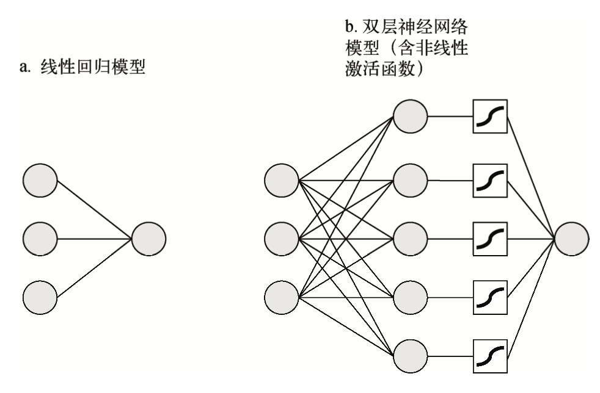
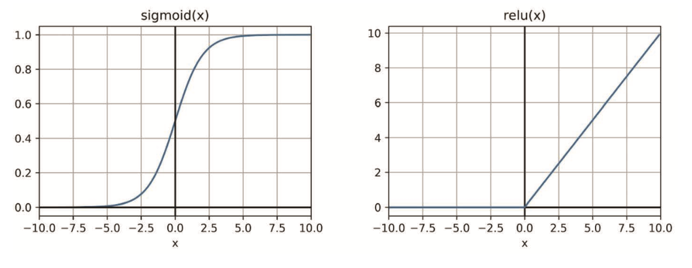
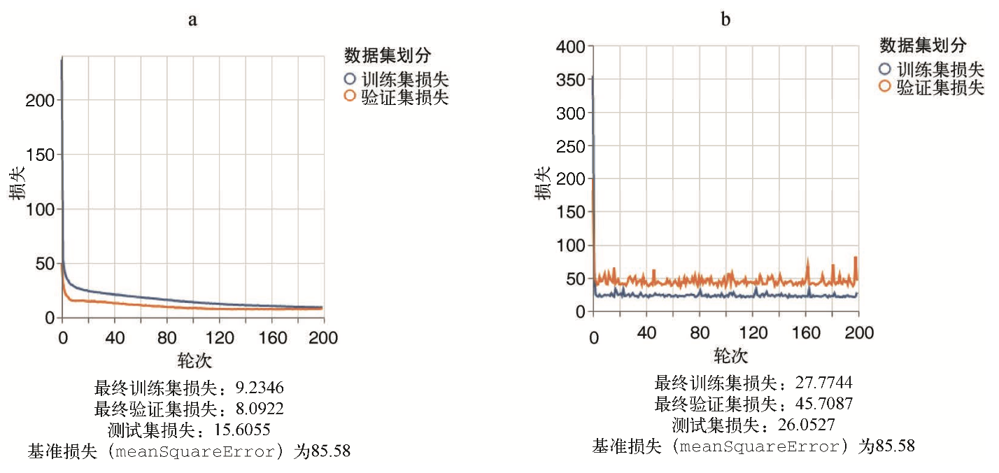

# 添加非线性：升级加权和

**非线性(nonlinearity)**，这是一种输入到输出的映射关系。与之前简单 地计算输入元素的加权和不同，非线性会增强神经网络的表示能力，而且如果使用得当，它可以 提高各种预测任务的准确率。

## 1 非线性的定义及其优势

```typescript
// 双层神经网络
export function multiLayerPerceptronRegressionModelHidden() {
    const model = tf.sequential();
    model.add(tf.layers.dense({
        inputShape: [bostonData.numFeatures],
        units: 50,
        activation: 'sigmoid',
        kernelInitializer: 'leCunNormal'
    }))
    model.add(tf.layers.dense({units: 1}))
    model.summary()
    return model
}
```

这里模型在代码中对应的函数名称为**多层感知机(multilayer perceptron, MLP)**。用这个术语描述的神经网络通常具有两个特征:第一，它有一个简单的无环拓扑结构， 也就是说它属于**前馈神经网络(feedforward neural network)**；第二，它至少有一个隐藏层。

```bash
# model.summary()方法，它是一个生成模型报告的工具，可以在控制台中打印 TensorFlow.js 模型的拓扑结构
Layer (type)                 Output shape              Param #
=================================================================
dense_Dense1 (Dense) 		  [null,50] 				650 _________________________________________________________________ 
dense_Dense2 (Dense) 		  [null,1] 					51 ================================================================= 
Total params: 701
Trainable params: 701 
Non-trainable params: 0
# 第一列 各层的名称与类型
# 第二列 各层的输出形状
# 第三列 各层权重参数的总数 表示组成该层权重的所有参数的个数，对包含多个权重的层而言，则表示所有权重的参数的总和。 例如 形状为[12, 50]的核，另一个形状为[50]的偏差，那么该层的训练参数为12 × 50 + 50 = 650
# 模型的权重参数、可训练参数以及不可训练参数对应的总数
```


### 1.1 直观地理解神经网络中的非线性

隐藏层包含一个非线性激活函数(activation function)，即代码中定义的`activation: 'sigmoid'`。获得密集层的最终输出，可以通过对矩阵中的元素逐个调用sigmoid函数来实现。

> **激活函数**一词源自对生物神经元的研究。生物神经元通过**动作电位(action potential)**，也就是在细胞膜上激发电 压，实现互相之间的通信。生物神经元通常会通过名为**突触(synapse)**的接触点接收来自很多上游神经元的信号。 上游神经元会以不同的频率激发动作电位，从而释放**神经递质(neurotransmitter)**，并且打开(或关闭)突触离子 通道，这将进一步导致接收端神经元细胞膜上电压的变化。这其实和密集层中一个单元所进行的加权和非常相似， 12 只有当电压超过一定阈值时，接收端神经元才会真正产生动作电位，也就是被“激活”，然后进一步影响下游神 经元的状态。从这个角度来看，普通生物神经元的激活函数与 ReLU 函数非常类似。ReLU 函数在输 入未达到一定阈值前输出为 0(处于“死区”)，当超过阈值后会随着输入线性增长，直到达到某个饱和级别(图 中没有显示)。



sigmoid 函数的图像是一条曲线，ReLU 函数的图像是两个线段的拼接。尽管这两个函数都是非线性的，但是它们都有一个属性，即函数上的每一点都是光滑且可微的 ，这样才可以通过它们进行反向传播算法 。深度学习中还有其他几种常用的可微非线性函数，包括 ReLU 函数和**双曲正切函数(hyperbolic tangent，简称 tanh)**。
$$
sigmoid：S(x)=\frac{1}{1 + e^{-x}}
$$

$$
relu(x) = {0: x < 0, x: x>=0}
$$



#### 非线性与模型容量

机器学习模型的**容量(capacity)**通常是指，模型能够学习的输入和输出关系的范围。对于拥有隐藏层和非线性激活函数的神经网络，其容量要大于线性 回归模型的容量。解释了为什么双层神经网络能够比线性回归模型取得更好的测试集准确率。

```typescript
// 三层神经网络, 总参数量3251
export function multiLayerPerceptronRegressionModel2Hidden() {
    const model = tf.sequential();
    model.add(tf.layers.dense({
        inputShape: [bostonData.numFeatures],
        units: 50,
        activation: 'sigmoid', 
        kernelInitializer: 'leCunNormal'
    }))
    model.add(tf.layers.dense({
        units: 50,
        activation: 'sigmoid', 
        kernelInitializer: 'leCunNormal'
    }))
    model.add(tf.layers.dense({units: 1}))
    model.summary()
    return model
}
```


#### 避免只增加层而不增加非线性的谬误

如果不使用sigmoid激活函数，双层神经网络就和单层 线性回归模型没什么两样!

构建多层神经 网络时的一个常见注意事项:**必须在隐藏层中添加非线性激活函数**。如果不这么做，就会导致计 算资源与时间的浪费，以及潜在的计算上的不稳定性。



> 移除 sigmoid 激活函数后，模型在训练集、验证集和测试 集上的最终损失值都升高了(退回到和之前的纯线性模型相当的水平)，其损 失曲线也变得更加不平滑。

#### 非线性与模型可解释性

非线性模型与线性模型获取权重值的 API 是完全相同的，只需在模型对象上或属于它的层对 象上调用 getWeights()。

```typescript
// 在模型训练后打印权重
model.layers[0].getWeights()[0].print();
```


### 1.2 超参数与超参数优化


## 2 输出端的非线性：分类任务的模型


### 2.1 二分类定义


### 2.2 度量二分类器的性能:准确率、精确率、召回率


### 2.3 ROC 曲线:展示二分类问题中的取舍关系


### 2.4 二元交叉熵:二分类问题的损失函数

## 3 多分类问题

### 3.1 对分类数据进行 one-hot 编码


### 3.2 归一化指数函数:softmax 函数


### 3.3 分类交叉熵:多分类问题的损失函数


### 3.4 混淆矩阵:更细粒度地分析多分类问题


## 4 EXAMPLE

