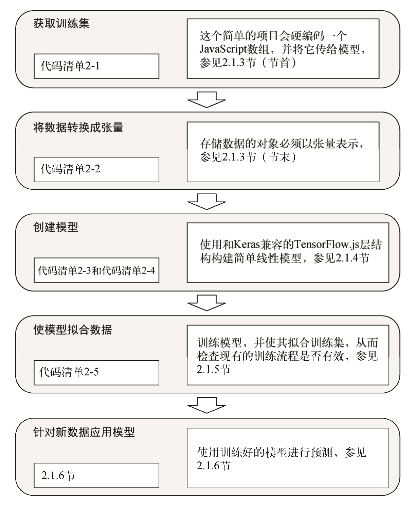
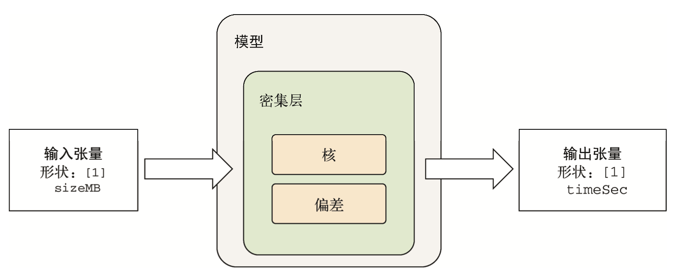

# TensorFlow.js 入门:从简单 的线性回归开始


## 1. 示例 1:用 TensorFlow.js 预测下载任务所需时间


### 1.1 项目概览：预测下载任务所需时间

为了更好地理解，这里从机器学习的整体流程入手：



在机器学习中，数据可以从多种渠道获得，比如从 硬盘中读取、从网络上下载、直接通过程序生成，或简单地硬编码。这里采用最后一种方法，因 为这样比较简便，而且涉及的数据量很小。其次将数据转换为张量，让它们能够输入模型中。下一步就是创建模型，这与函数的概念类似，相当于设计一个可训练函数，能够 将输入数据映射到预测目标。在本例中，输入数据和预测目标都是数字。一旦准备好模型和数据 后，就可以开始训练模型，并查看它在训练过程中生成的度量指标报告了。在这一切完成后，就可以用训练好的模型来预测未曾出现的数据，同时评估模型的准确率。

### 1.2 创建和格式化数据

```html
<script src='https://cdn.jsdelivr.net/npm/@tensorflow/tfjs@latest'></script>
<script>
    // 训练机
	const trainData = {
       sizeMB: [0.080, 5.000, 0.002, 7.000,9.000, 0.001, 0.100, 8.000, 0.100, 6.000, 0.050, 0.500, 2.000, 0.005, 10.00, 0.010, 6.000, 5.000, 1.000, 1.000],
		timeSec: [0.135, 0.435, 0.070, 0.560,0.739, 0.067, 0.126, 0.646, 0.069, 0.497, 0.068, 0.116, 0.289, 0.076, 0.744, 0.083, 0.480, 0.399, 0.153, 0.149]
};
	// 测试集
	const testData = {
		sizeMB: [5.000, 0.020, 0.005, 7.000, 0.200, 0.001, 9.000, 0.002,0.008, 4.000, 0.001, 1.000,0.080, 0.800, 0.200, 0.050,0.005, 0.002, 8.000, 0.008],
    	timeSec: [0.425, 0.078, 0.052, 0.558,0.098, 0.052, 0.686, 0.066, 6 0.070, 0.375, 0.058, 0.136,0.063, 0.183, 0.087, 0.066, 0.066, 0.068, 0.610, 0.057]
	}; 
</script>
```

一个输入 和一个输出对应的组合通常叫作**样例(example)**。输出通常又叫作**目标(target)**，输入中的各种 元素叫作**特征(feature)**。在本示例的 40 个样例中，每个样例都正好有一个**特征(sizeMB)**和一个**数值目标(timeSec)**。

首先，让神经网络拟合训练集，从而根据给定的 sizeMB 来准确预测 timeSec。然后，让神经网络基于测试集中的 sizeMB 进行预测。接着，将预测值 与测试集中的 timeSec 进行比较，计算它们的接近程度。在开始实践之前，需要将这些数据转 换成 TensorFlow.js 能支持的格式，那就是张量。

```typescript
// 将数据转换成张量
const trainTensors = {
    sizeMB: tf.tensor2d(trainData.sizeMB, [20, 1]),
    timeSec: tf.tensor2d(trainData.timeSec, [20, 1])
}
const testTensors = {
    sizeMB: tf.tensor2d(testData.sizeMB, [20, 1]),
    timeSec: tf.tensor2d(testData.timeSec, [20, 1])
}
// 此处的[20, 1]描述的是张量的“形 状”，后面会详细解释。简单来说，这 里的形状意味着我们想将原数组理解为 20 个样本，每个样本都是 1 个数字。 如果可以从数组的结构或其他位置明 显推断出形状，则可以省略此参数
```

张量本质上是数据的容器，而数据几乎总是数值类型。因此，可以将它看作数值的容 器。你可能已经很熟悉向量和矩阵，其实它们本质上分别是一维张量和二维张量。张量是将矩阵 概念泛化到任意维度的结果，维度数和每个维度的尺寸叫作张量的**形状(shape)**。例如，3×4 的 矩阵就是形状为[3, 4]的张量，长度为 10 的向量就是形状为[10]的一维张量。

在张量的语境下，维度通常又叫作**轴(axis)**。在 TensorFlow.js 中，无论底层使用 CPU、GPU 还是其他硬件，都使用张量来实现互相通信和协作，它是不同组件之间共通的表示。

### 1.3 定义简单的模型

在深度学习的语境下，将输入特征映射到输出目标上的函数叫作**模型(model)**。模型函数接 收特征，执行一些计算，然后生成预测值。这里构建的模型函数将文件大小作为输入(特征)， 然后输出下载所需时间(预测值)，在深度学习中，模型还可以叫作**网络(network)**， 它们所指是一样的。我们的第一个模型将用**线性回归(linear regression)**来实现。

在机器学习中，**回归(regression)**指模型会输出实数值，并且会尝试匹配训练集中的目标。 这一点和**分类(classification)**是不一样的，后者输出的是从一系列选项中做出的选择。在回归 任务中，模型输出的数字越接近目标数字，其性能就越优异。当输入包含多个特征时，可以将其看作高维空间中的一个平面。模型有一个重要 特性，那就是**可调性(tunable)**。这意味着可以调整输入到输出的计算。我们利用这一特性来调 整模型，让它更“拟合”数据。

```typescript
// 构建线性回归模型
const model = tf.sequential()
model.add(tf.layers.dense({inputShape: [1], units: 1}));
```

神经网络的核心组成部分是**层(layer)**，它是一个数据处理模块，可以看作张量之间的一个 可调函数。这里的模型由单个密集层组成，正如参数 inputShape: [1]所定义的那样，这一层 对输入张量的形状进行了约束。也就是说，这一层需要一个一维张量作为输入，其中仅包含一个 数值。密集层都会输出一个一维张量，但其尺寸可以通过 units 属性进行配置。

密集层就是执行每组输入与输出之间的可调的乘积累加(multiply-add)运算。 因为只有一个输入和一个输出，所以这个模型就是高中所学的简单线性方程:y = m * x + b。 在密集层中，m 叫作核(kernel)，b 叫作偏差(bias)。


$$
timeSec = kernel \times sizeMB + bias
$$
其中有两项在模型训练中是固定不变的。具体而言，sizeMB 和 timeSec 的值由训练集决定。剩余的 kernel 项和 bias 项是模型的参数， 它们的值是在模型创建之初随机选定的。由这些随机数值生成的文件下载所需时间的预测值不太 理想，为了得到较好的预测值，必须让模型从数据中学习，自动为核与偏差寻找恰当的数值。这 个寻找的过程就是**训练过程(training process)**。

核与偏差可以统称为权重，要为它们设定恰当的数值，需要下面两项内容:

- 判断当前权重设定值是否理想的度量指标。
- 根据上述度量指标产生的度量结果更新权重，从而在下一轮训练中实现更优异的性能(使用相同的度量指标评估)。

为了更好地训练模型，还需要选择度量性能和更新参数的方法，分别对应前面提到的两项内容。这属于 TensorFlow.js 中**模型编译(model compliation)** 阶段的一部分。编译阶段需要进行两项配置，即损失函数和优化器。

- **损失函数(loss function)**，即度量误差(error)的方法。这是模型度量训练集性能的方法， 同时也是正确改善模型的重要依据，损失越低越好。在训练时，如果绘制损失随时间变 化的图，应该能看到损失会逐渐降低。如果模型训练了很久，损失仍旧没有降低，这就 意味着模型并没有学习如何拟合数据。后面的章节会介绍如何调试这类问题。
- **优化器(optimizer)**，即模型基于数据和损失函数更新权重(核和偏差)所使用的算法。

```javascript
model.compile({optimizer: 'sgd', loss: 'meanAbsoluteError'});
/*
	模型编译，调用compile方法
	sgd 为优化器
	meanAbsoluteError 为损失函数（指损失函数会先计算预测 modelOutput 和 target 的差值，然后取绝对值，最后返回这些绝对值的均值）
	meanAbsoluteError = average( absolute( modelOutput - target ))
*/
```

如果模型做出离目标相差甚远的错误预测，那么 `meanAbsoluteError` 就会非常大。`sgd` 是**随机梯度下降算法（stochastic gradient descent）**，简单说会用微积分来计算如何调整权重从而减小。

### 1.4 使模型拟合训练集

1. `fit()` 方法训练模型

```javascript
// 代码中通过调用 fit() 方法来训练模型，让模型更好地拟合训练集。
window.onload = async () => {
    // ... 模型的定义
    await model.fit(trainTensors.sizeMB, trainTensors.timeSec, {epochs: 10});
    // epochs属性的配置对象，指定要针对训练集进行10次训练。
    // 在深度学习领域，针对训练集的每一次完整迭代叫做一个轮次（epoch）
}
```

2. `evaluate()` 方法评估模型，会根据输入的样例和目标来计算损失函数的值。evaluate 方法并不会更新模型的权重，评估模型相对于测试集的性能，可以了解到模型在应用程序中的表现情况。

```javascript
model.evaluate(testTensors.sizeMB, testTensors.timeSec).print(); // 计算测试集的性能，错误率
// 例如打印：0.673499345779419
```

3. 手动计算平均绝对误差

```javascript
const avgDelaySec = tf.mean(trainData.timeSec); 
avgDelaySec.print() // 0.295
tf.mean(tf.abs(tf.sub(testData.timeSec, 0.295))).print() // 0.22
// testData.timeSec.sub(0.295).abs().mean().print() 链式操作结果同上
// tf.sub() 计算差值
// tf.abs() 绝对值
// tf.mean() 平均值
```

结果发现当前模型的准确率低于最简单的预测方法（0.673 > 0.22）。然后将 `model.fit(testData.sizeMB, testData.timeSec, {epochs: 200})` 迭代次数增加到200，会看到结果得出 0.045515045523643494，明显是误差小了很多。

之前的模型是**欠拟合（underfiting）**的，也就是不够适应训练集。有欠拟合就会有**过拟合（overfiting）**，过拟合问题更难发现，是指模型针对训练集调整过多，导致不能很好将训练集规则泛化到未曾见过的数据上。

### 1.5 用经过训练的模型进行预测

```javascript
const smallFileMB = 1;
const bigFileMB = 100;
const hugeFileMB = 10000;
model.predict(tf.tensor2d([[smallFileMB], [bigFileMB], [hugeFileMB]])).print();
// [[0.1373825  ], [7.2438402  ], [717.8896484]]
```

一般而言，**外推(extrapolate)**远超出训练集范围的值是非常冒险的。此处将输入的变量封装成了适当形状的张量。输入张量的形状 inputShape 定义为[1]，也就是对模型来说，每个输入样例都必须是这个形状。每次调用 fit()和 predict() 都需要用到多个样例，因此，如果要提供 n 个样例，可以叠加输入样例，并把它们封装到一个输 入张量中，这样它的形状就是[n, 1]。如果我们忘了这些方法对张量形状的要求，向模型输入 了一个形状不匹配的张量，就会触发形状错误。

## 2. model.fit()内部原理剖析:示例1中的梯度下降算法


### 2.1 直观理解梯度下降算法优化


### 2.2 探索梯度下降算法的内部原理:反向传播算法


## 3. 示例 2:涉及多个输入特征的线性回归


### 3.1 波士顿房价数据集


### 3.2 从 GitHub 获取并运行波士顿房价预测项目


### 3.3 读取波士顿房价数据


### 3.4 准确定义波士顿房价问题


### 3.5 线性回归前的准备工作:数据标准化


### 3.6 对波士顿房价数据集进行线性回归

## 4. 如何理解模型


### 4.1 解释习得的权重


### 4.2 获取模型内部权重


### 4.3 关于可解释性的注意事项


## 5. EXAMPLE

